# Cüzdan

A modern web app to create Apple Wallet passes (.pkpass files). Built with Bun + TypeScript.

[](https://github.com/keskinonur/cuzdan/blob/main/LICENSE)
[](https://bun.sh)
[](https://www.typescriptlang.org/)

## Features

- **Beautiful UI** — Dark theme with glassmorphism design and live pass preview
- **Multiple Pass Types** — Loyalty cards, event tickets, boarding passes, coupons, gym memberships, coffee cards, library cards
- **Advanced Options** — Set expiration dates and relevant dates for lock screen notifications
- **Barcode Scanner** — Scan existing QR codes and barcodes with your device camera
- **QR Code Sharing** — Generate QR codes to add passes directly to any iPhone
- **Bilingual** — Full English and Turkish language support with auto-detection
- **Single Binary** — Compile to one executable (~58MB), runs anywhere
- **Smart Port Detection** — Auto-finds available port if default is busy
- **Auto Browser Open** — Opens your browser automatically on server start
- **Privacy First** — All processing happens locally, no data stored

## Screenshots

### Desktop

| Home | Pass Builder | Share Modal |
|:---:|:---:|:---:|
| 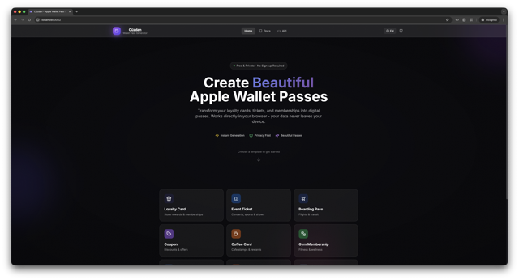 | 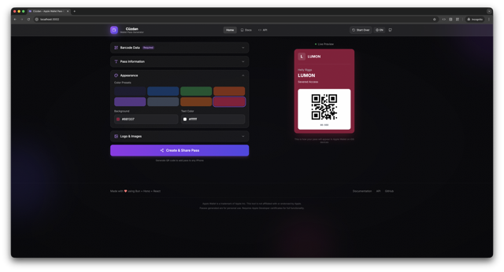 | 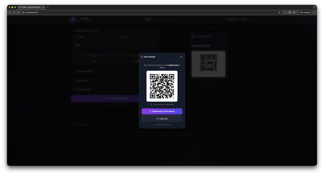 |

| Documentation | API Reference |
|:---:|:---:|
| 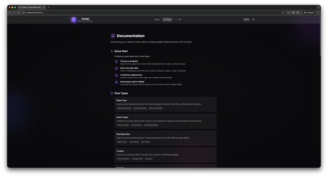 | 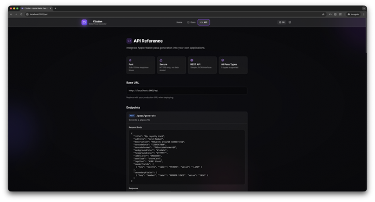 |

### Mobile

| Home | Builder | Share |
|:---:|:---:|:---:|
| 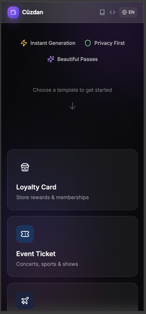 | 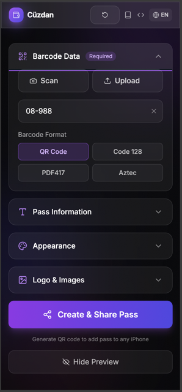 | 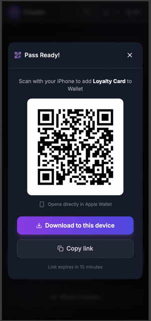 |

### Turkish Language Support

| Home (TR) | Docs (TR) | API (TR) |
|:---:|:---:|:---:|
| 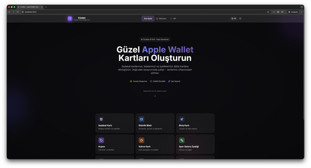 | 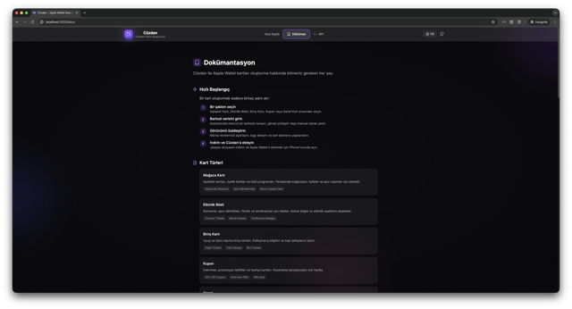 | 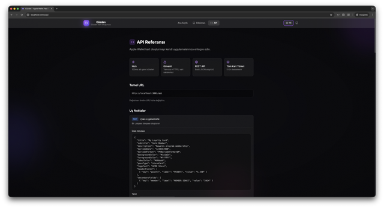 |

## Quick Start

```bash
# Install dependencies
bun install

# Start development server (opens browser automatically)
bun run dev
```

Visit `http://localhost:3002` (or the next available port).

## Production Build

```bash
# Build + compile to single binary
bun run compile

# Run the binary
./dist/cuzdan
```

The `dist/` folder contains:
- `cuzdan` — Single executable (~58MB)
- `client/` — Static frontend files (embedded in binary)

## Configuration

Create a `.env` file (or copy from `.env.example`):

```env
PORT=3002
NO_OPEN=1  # Disable auto-opening browser

# Apple Developer (required for signed passes)
PASS_TYPE_IDENTIFIER=pass.com.yourcompany.wallet
TEAM_IDENTIFIER=YOUR_TEAM_ID
SIGNER_KEY_PASSPHRASE=your_password
```

## Apple Developer Setup

To create passes that actually work in Apple Wallet, you need signing certificates from Apple.

### Quick Overview

1. **Get an Apple Developer account** ($99/year) — [developer.apple.com/programs](https://developer.apple.com/programs/)

2. **Create a Pass Type ID** in the [Developer Portal](https://developer.apple.com/account/resources/identifiers/list/passTypeId)

3. **Create & download a certificate** for your Pass Type ID

4. **Export from Keychain Access** as `.p12` file

5. **Convert to PEM format** (use `-legacy` flag for OpenSSL 3.x):
   ```bash
   openssl pkcs12 -in Certificates.p12 -clcerts -nokeys -out signerCert.pem -legacy
   openssl pkcs12 -in Certificates.p12 -nocerts -out signerKey.pem -legacy
   ```

6. **Download Apple's WWDR certificate** from [Apple PKI](https://www.apple.com/certificateauthority/) and convert:
   ```bash
   openssl x509 -in AppleWWDRCAG4.cer -inform DER -out wwdr.pem
   ```

7. **Place all three files** in `certs/` folder:
   ```
   certs/
   ├── wwdr.pem
   ├── signerCert.pem
   └── signerKey.pem
   ```

> Without certificates, the app still works but generates unsigned passes for testing the UI.

## Project Structure

```
cuzdan/
├── server/                 # Backend (Hono)
│   ├── index.ts           # Server entry point
│   ├── config.ts          # Port detection, env loading
│   ├── static.ts          # Static file serving
│   ├── routes/
│   │   └── pass.ts        # API routes
│   ├── services/
│   │   └── passGenerator.ts
│   └── utils/
│       └── openBrowser.ts
├── src/                    # Frontend (React)
│   ├── main.tsx           # React entry
│   ├── App.tsx            # Main app with routing
│   ├── components/        # UI components
│   │   ├── Header.tsx
│   │   ├── Hero.tsx
│   │   ├── TemplateSelector.tsx
│   │   ├── PassBuilder.tsx
│   │   ├── PassPreview.tsx
│   │   ├── ShareModal.tsx
│   │   ├── BarcodeScanner.tsx
│   │   └── Footer.tsx
│   ├── pages/
│   │   ├── Docs.tsx       # Documentation page
│   │   └── Api.tsx        # API reference page
│   ├── lib/
│   │   ├── i18n.ts        # Translation strings
│   │   └── LanguageContext.tsx
│   └── types/
├── certs/                  # Apple certificates (gitignored)
├── dist/                   # Production build output
└── public/                 # Static assets
```

## Scripts

| Command | Description |
|---------|-------------|
| `bun run dev` | Start dev server with hot reload |
| `bun run dev:client` | Start frontend only (Vite) |
| `bun run build` | Build for production |
| `bun run compile` | Build + compile to single binary |
| `bun run typecheck` | Check TypeScript types |
| `bun test` | Run unit tests |
| `bun test --watch` | Run tests in watch mode |

## Tech Stack

- **Runtime** — [Bun](https://bun.sh) (fast all-in-one JavaScript runtime)
- **Backend** — [Hono](https://hono.dev) (ultrafast web framework)
- **Frontend** — React 18 + Vite + Tailwind CSS + Framer Motion
- **Pass Generation** — [passkit-generator](https://github.com/alexandercerutti/passkit-generator)
- **QR Codes** — qrcode (generation) + jsQR (scanning)

## API

The app includes a REST API for programmatic pass generation:

```bash
# Generate a pass
curl -X POST http://localhost:3002/api/pass/generate \
  -H "Content-Type: application/json" \
  -d '{
    "title": "My Card",
    "barcodeData": "123456",
    "barcodeFormat": "PKBarcodeFormatQR",
    "backgroundColor": "#1a1a2e",
    "passType": "storeCard"
  }' \
  -o pass.pkpass

# Get templates
curl http://localhost:3002/api/pass/templates

# Health check
curl http://localhost:3002/api/health
```

See the `/api` page in the app for full API documentation with examples in JavaScript, Node.js, and Python.

## Internationalization (i18n)

The app supports English and Turkish:

- Language is auto-detected from browser settings
- Users can toggle language via the globe icon in the header
- Preference is saved to localStorage
- All UI text, including Docs and API pages, is fully translated

To add more languages, edit `src/lib/i18n.ts`.

## Contributing

Contributions are welcome! Please feel free to submit a Pull Request.

1. Fork the repository
2. Create your feature branch (`git checkout -b feature/amazing-feature`)
3. Commit your changes (`git commit -m 'Add some amazing feature'`)
4. Push to the branch (`git push origin feature/amazing-feature`)
5. Open a Pull Request

## License

MIT - see [LICENSE](LICENSE) for details.

## Links

- **Repository**: [github.com/keskinonur/cuzdan](https://github.com/keskinonur/cuzdan)
- **Issues**: [github.com/keskinonur/cuzdan/issues](https://github.com/keskinonur/cuzdan/issues)

---

*Apple Wallet is a trademark of Apple Inc. This tool is not affiliated with or endorsed by Apple.*
